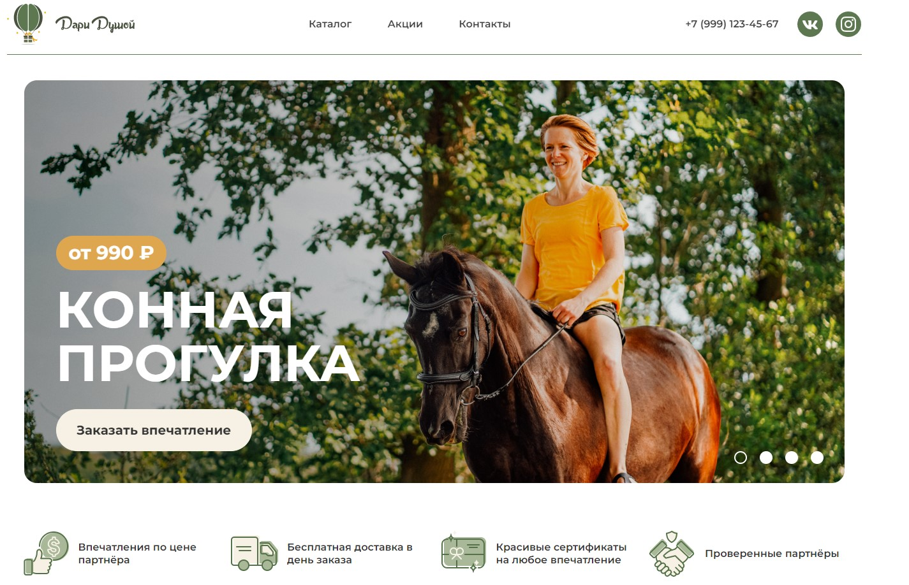

<h1 align="center">Сайт магазина сертифкатов "Дари Душой"</h1>
<h2 align="center">Как посмотреть</h2>

Скачать репозиторий и открыть в браузере index.html или посмотреть по <a href="https://kovalinam.github.io/SoulGift/">ссылке</a>.

 Макет Figma, на основе которого выполнялалась верстка, доступен по <a href="https://buildhtml.ru/template/193">ссылке</a>. Вносила изменения на свое усмотрение, например, адаптив футера выполнен на свое усмотрение.

<h2 align="center">Описание выполненной работы и используемых технологий</h2>

Выполнена адаптивная семантическая верстка (html5, css3) с использованием SASS/SCSS.

На JS скрипты для всплывающих окон Заявки и Описания услуг, аккордеона в разделе Часто задаваемых вопросов, выпадающего меню в попапе с описанием услуги.

Подключен slider slicker.

HTML проверен в валидаторе - по итогу чист, не имеет никаких замечения и предупреждений.

<h2 align="center">Скриншот главного экрана страницы</h2>

